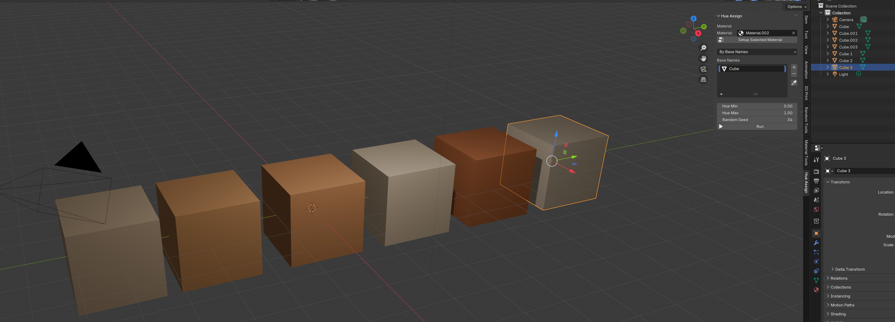

# MakerScapeBlenderUtilities
Some convenient addons for working with Blender

### Randomize Children sizes
Pick the parent (typically an empty) and the children (e.g. leaves on a tree, or plants in a field) will receive a random scale. The scale can either be absolute ("Scale value" mode) or they can be multiplied by the factor ("Multiplicative mode")

### Randomize Hue

This will setup the material you pick to use a randomize value from a default color ramp (you can of course customize the color ramp), it then assigns the random value and the material to the objects matching the mode. 

The mode can be 

"Base Name"
"Cube" will match "Cube.001, Cube.002, etc as well as Cube 1, Cube 2, etc".

"Children of picked parent"
Another way is to pick a parent object and the children will receive the randomization.

### Apply material to children
Very simply apply a material to all the children of an object